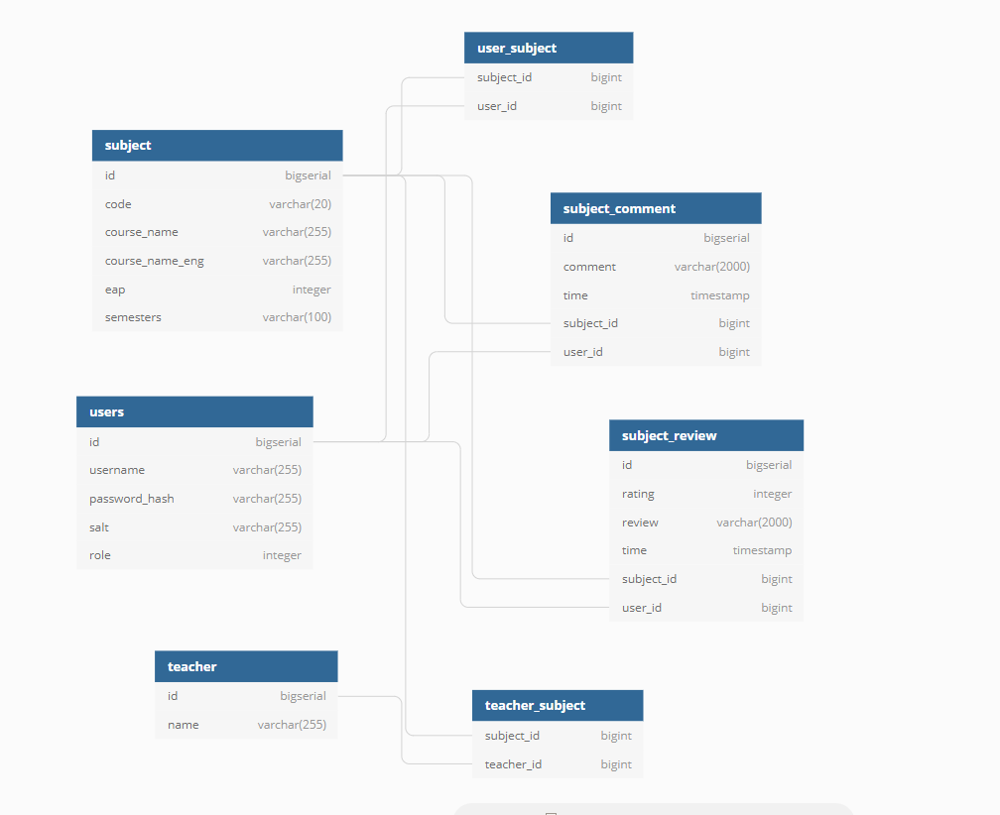

# Database layout




# Currently supported endpoints

Schemas for post are located at ```/backend/schema```

* post
    * /users
    * /subjects/{id}/comments
    * /subjects/{id}/reviews
* get
    * /login
    * /users/{id}
    * /users/{id}/subscriptions
    * /subjects
    * /subjects/{id}
    * /subjects/{id}/reviews
    * /subjects/{id}/comments
* put
    * /users/{id}/subscriptions
* delete
    * /users/{id}/subscriptions/{subject_id}


Getting Started
----
## Quick install and setup

##### Debian
run in terminal:
```
./frontend_local_install.sh
```
This script has been tested on Ubuntu 18.04 and 19.04
##### Other operating systems
Install Debian based operating system and read the guide above.
 
or 

Read the `frontend_local_install.sh` file and acquire inspiration 
for necessary steps from there.

## Manual setup

#### Local docker with postgres ####

You need latest of: Docker

```
git clone https://gitlab.cs.ttu.ee/envomp/iti0203-2019-project.git
cd iti0203-2019-project
docker-compose up -d
```

#### Local host machine with H2 ####
You need latest of: Java11

___
##### for Linux
```
./mvnw clean install
java -jar -Dspring.config.location=src/main/resources/application-dev.properties target/backend-0.0.1-SNAPSHOT.jar
```


##### for Windows

```
mvnw.cmd clean install
java -jar -Dspring.config.location=src/main/resources/application-dev.properties target/backend-0.0.1-SNAPSHOT.jar
```

____

## Docker cleanup

stop all containers:
docker kill $(docker ps -q)

remove all containers
docker rm $(docker ps -a -q)

remove all docker images
docker rmi $(docker images -q)

## Azure set up

### Backend
- Uses Azure web app service.
- Backend is reachable on the url you provide during web app service initial set up. (https://iti0203-team04-back.azurewebsites.net/ for our project) 
#### Docker 
- Single container mode.
- Docker image is downloaded from Azure image registry.
- Pipeline is set up to build a docker image and deploy it to image registry.
#### Networking
- Backend is served using Apache Tomcat.
- Tomcat listens on port 8098 but it is forwarded using docker.
- Backend is accessable on port 80 using both http and https protocols.
    - Docker compose sets the image to use different port but it is forwarded to use 80 by Azure.
- Port 9001 is used for management (Actuator)
#### Logs
- Logs are accessable on https://iti0203-team04-back.scm.azurewebsites.net/api/vfs/LogFiles/ or replace iti0203-team04 with the name of your web app service.
- New logfiles for each day
- Four log files
    - 2019_11_14_..._easyauth_docker.log logs requests to the backend
    - 2019_11_14_..._default_docker.log logs backend output
- Additionally on Azure you can look at Log stream which is realtime logging of the web app service.

### Database
- Uses Azure postgres database service.
- Database is reachable on the url you provide during web app service initial set up. (greenchatdb.postgres.database.azure.com for our project)
- First time set up requires setting up an empty table named `users` otherwise backend will not function correctly.
- Database contents can be managed using Adminer or other similar tools.
- Database username and password is agonaut@greenchatdb:AgonaudidTeam4


Planned works:none
-------

* [X] Implement admin page and functionality for it in frontend and backend. (username: agonaudid, password: team4)
* [X] Implement JWT security token for authentication when using public endpoints.
* [X] Restructure API.
* [X] Implement removing users, comments and reviews.
* [X] Implement displaying users, comments and reviews.
* [X] Write more unit tests and integration tests. Especially for endpoints.

Analysis sheet
-------

___Must haves are marked so___

* As a student who has taken the course...
    * [X] ___<span>...I can write a more detailed review of the course to help others who might be interested in it.</span>___
    * [X]  ___<span>...I can write a comment on what the structure is like and what to expect to help others who might be interested in it.</span>___
* As an admin...
    * [X] ___<span>...I can delete other users.</span> [Part 3]___
    * [X] ___<span>...I can delete other users comments and reviews.</span> [Part 3]___
* As a student...
    * ...I can sign up for an account...
        * [X] ___<span>...keep my data secure and prevent unauthorized access.</span>___
        * [X] <span>...to delete my comments and reviews.</span> [Part 3]
    * upon logging in...
        * [X]  ___<span>...I can subscribe to a subject and see a list of subjects I have subscribed to</span> [Part 3]___
        * [X]  ___<span>...I can search for subjects in order to find ones I might be interested in and subscribe to them.</span>___
        * [X]  ___<span>...I can see what others are saying about a subject to better make a decision on taking it.</span>___
* As a developer...
    * [X]  ___<span>...I can test every class with important business logic in it with unit test before it goes into production.</span>___
    * [X] ___<span>...I don't have to manually insert and update the subjects.</span>___
    * [X] <span>...I can easily run the project locally and in docker.</span
    * [X] <span>...I can run frontend separately from backend(and vice versa) for debugging purposes.</span>
    * [X] <span>...I can use Flyway to manage database migrations.</span>
    * [X] <span>...I have at least 60% of code tested, so i can be sure my added features dont introduce new bugs.</span> [Part 3]
    * [X] <span>...I can be sure, that vulnerable endpoints are protected via JWT authentication.</span> [Part 3]
* [X] ___<span>  As an external developer I want to use their REST API.</span>___
* [X] ___<span> As an agofan I can rate Ago’s subjects with maximum points.</span>___
* [ ] <span> As an Oleg I can grade this project at least with some points, maybe... :party_parrot:</span>
